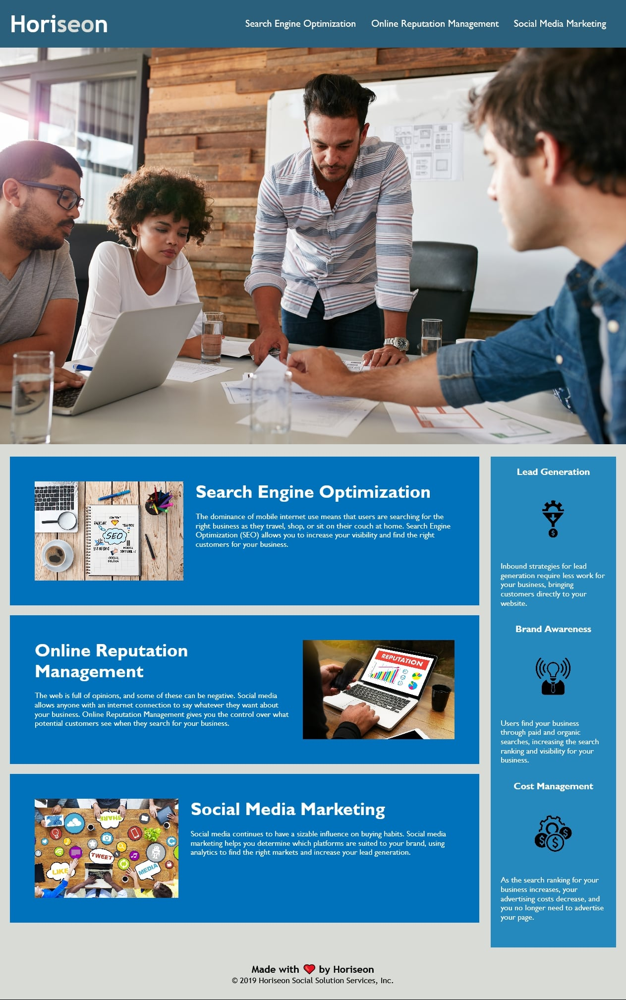

# Horiseon

[](https://opensource.org/licenses/MIT)

## Description
A website for a marketing agency called Horiseon, that offers services like Search Engine Optimization, Online Reputation Management and Social Media Marketing.

## Website
https://deepikabekal.github.io/Horiseon/

## Screenshot


## Technologies Used
* HTML
* CSS

## Contact Info
If any queries please send me an email at deepika.bekal2@gmail.com

## User Story
```
I WANT a codebase that follows accessibility standards
SO THAT our own site is optimized for search engines
```

## Acceptance Criteria
```
GIVEN a webpage meets accessibility standards
WHEN I view the source code
THEN I find semantic HTML elements
WHEN I view the structure of the HTML elements
THEN I find that the elements follow a logical structure independent of styling and positioning
WHEN I view the image elements
THEN I find accessible alt attributes
WHEN I view the heading attributes
THEN they fall in sequential order
WHEN I view the title element
THEN I find a concise, descriptive title
```
## Code Changes
* Added a title to the web page.
* Added header tag in HTML for accessibility and changed the respective CSS selector in the stylesheet.
* Added nav tag (navigation semantic element) in HTML and changed the respective CSS selector in the stylesheet.
* Entered the correct CSS selector for the a tag (Anchor element) in the stylesheet.
* Fixed the Search Engine Optimization link by adding appropriate id attribute to the Search Engine Optimization section in HTML.
* Added section and article tags for accessibility.
* Added footer tag in HTML and changed the respective CSS selector in the stylesheet.
* Added alt attributes for all img tags in HTML.
* Added appropriate comments in HTML and stylesheet files.
* Consolidated and organized CSS selectors and properties to follow semantic structure.

## References
* Study Material for HTML and CSS provided by Trilogy Education Services.
* MDN Web Docs https://developer.mozilla.org/en-US/docs/Glossary/Semantics
* How to write a kickass README (https://dev.to/scottydocs/how-to-write-a-kickass-readme-5af9#template)


